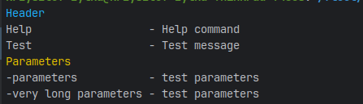

# Install
```bash
composer require krzysztofzylka/console
```

# Methods
## Print
```php
\Krzysztofzylka\Console\Prints::print('value');
```
## Simple print
```php
\Krzysztofzylka\Console\Prints::sprint('value');
```
## Get args
```php
\Krzysztofzylka\Console\Args::getArgs($argv)
```
## Generate helper

```php
$help = new \Krzysztofzylka\Console\Generator\Help();
$help->addHeader('Header');
$help->addHelp('Help', 'Help command');
$help->addHelp('Test', 'Test message');
$help->addHeader('Parameters', 'yellow');
$help->addHelp('-parameters', 'test parameters');
$help->addHelp('-very long parameters', 'test parameters');
$help->render();
```


## Form

### Input
```php
$input = \Krzysztofzylka\Console\Form::input();
$input = \Krzysztofzylka\Console\Form::input('Firstname:');
```

### Prompt
```php
\Krzysztofzylka\Console\Form::prompt('Continue?');
```